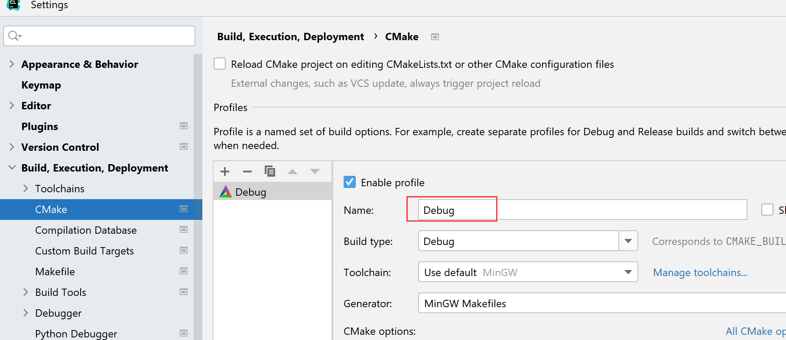

# 综合案例：跨平台下载软件

> 更新于 2023.8

## 环境配置

### 1. 安装 conan

课程源码目前已经适配了 conan 1.59.0，同学可以通过以下命令查看 conan 的版本：

```
conan -v
```

如果版本不是 1.59.0，请先删除：

```
pip uninstall conan
```

接下来执行以下命令安装：

```
pip install conan==1.59.0
```

### 2. conan 的 profile

由于本节需要使用 Conan 管理依赖，因此需要让 Conan 知道编译器的配置。

#### 2.1 创建默认的 profile（非 Windows 用户）

mac 和 Linux 的用户可以使用 conan 命令创建默认的 profile：

```
conan profile detect
```

这样 conan 会自动检测当前的编译器生成对应的 profile，生成的 profile 文件路径为 

```
<你的用户目录>/.conan/profiles/default
```

>**说明** conan 自动检测生成的 profile 在 mac 上是 xcode 的 apple clang 编译器，Linux 上是 gcc，Windows 上是 msvc。由于本章的程序在 Windows 上需要使用 MinGW 环境的 gcc 编译器，因此我们需要专门为 Windows 进行额外的配置，见 2.2 节。

#### 2.2  配置 MinGW（仅 Windows 用户需要）

Windows 的用户需要在

```
<你的用户目录>/.conan/profiles/
```

路径下创建一个新文件，例如命名为 mingw64，添加以下内容：

```
MSYS2_ROOT=C:/msys64
MINGW64_ROOT=C:/msys64/mingw64

[settings]
os_build=Windows
os=Windows
arch=x86_64
arch_build=x86_64
compiler=gcc
compiler.version=9.2
compiler.exception=seh
compiler.libcxx=libstdc++11
compiler.threads=posix
build_type=Release

[env]
MSYS_ROOT=$MSYS2_ROOT/bin
MSYS_BIN=$MSYS2_ROOT/usr/bin
CONAN_CMAKE_GENERATOR="MinGW Makefiles"
CXX=$MINGW64_ROOT/bin/g++.exe
CC=$MINGW64_ROOT/bin/gcc.exe
CONAN_BASH_PATH=$MSYS2_ROOT/usr/bin/bash.exe
PATH=[$MSYS2_ROOT/usr/bin, $MINGW64_ROOT/bin]

[conf]
tools.microsoft.bash:subsystem=msys2
tools.microsoft.bash:path=$MSYS2_ROOT/usr/bin/bash.exe
```

注意 `MSYS2_ROOT` 和 `MINGW64_ROOT` 需要替换成你自己实际的安装路径。如果你安装时选择的是默认的路径，那么应该就不用修改。

#### 2.3 安装 zstd （仅 Windows 用户需要）

curl 从 7.72 开始加入 zstd 编码模块，windows 上 mingw 不会自动引入这个依赖，通过 msys 安装：

```
pacman -S mingw-w64-x86_64-zstd
```
安装后通过 pkg-config 确认：

```
$pkg-config --list-all | grep zstd
libzstd               zstd - fast lossless compression algorithm library
```

> 说明：如果同学们使用我打包好的 msys 包来安装的话，这一步实际上也可以省略。

### 3. 依赖配置

#### 3.1 安装依赖

在安装依赖之前，请大家注意 conanfile.txt 的依赖配置：

```
[requires]
libcurl/7.86.0
openssl/1.1.1s
sqlite3/3.32.3
tinycthreadpool/1.0

[generators]
cmake
```

其中 libcurl 的版本更新至 7.86.0。这个版本修复了之前版本在 MinGW 环境下安装时编译失败的问题。

接下来，进入 MinGW 编译器对应的 cmake 目录，目录的命名与 CLion 中的 cmake 配置有关，如图：



如果 Name 为 "Debug"，那么目录名默认为 "cmake-build-debug"。

**Windows 用户执行下面的命令**：

```
cd cmake-build-debug
conan install .. --profile=mingw64 --build=missing
```

**mac/Linux 用户执行下面的命令**：

```
cd cmake-build-debug
conan install .. --build=missing
```

之后等待编译即可，如果网络通畅，通常需要 10 分钟左右。如果遇到问题，可先尝试自行搜索，看看能否独立解决问题；如果无法自己解决，请复制完整的编译信息，在问答区提问。